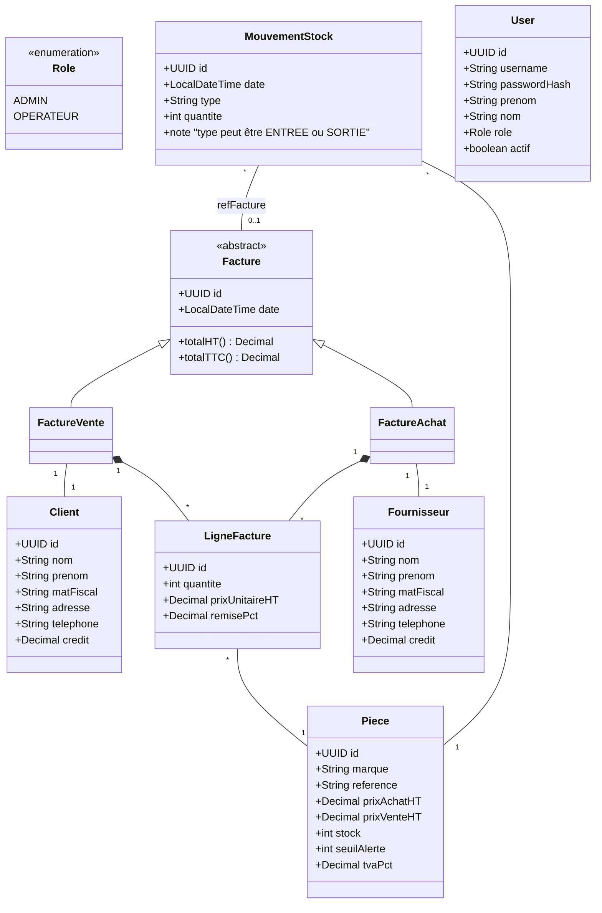

# Application de Gestion de Stock

Ceci est une application de bureau pour la gestion de stock, développée en Windows Forms.

## Structure du projet

- `StockApp.csproj`: Fichier projet C#.
- `Program.cs`: Point d'entrée de l'application Windows Forms.
- `MainForm.cs`: Formulaire principal de l'application, contenant la navigation par onglets et la barre de recherche.
- `Data/Entities`: Contient les classes du modèle de données (Client, Piece, Facture, etc.).
- `Views/ClientForms`: Contient les formulaires pour la gestion des clients:
  - `ClientManagementForm.cs`: Formulaire principal avec la liste des clients et les boutons d'action
  - `ClientDetailsForm.cs`: Formulaire de détail pour ajouter ou modifier un client
- Autres dossiers de formulaires à créer: `FournisseurForms`, `PieceForms`, etc.

## Diagramme de classes (Mermaid)

(Le diagramme fourni par l'utilisateur sera intégré ou référencé ici ultérieurement)

## Fonctionnalités implémentées

- Affichage de la liste des clients
- Ajout d'un nouveau client
- Modification d'un client existant
- Suppression d'un client

## Prochaines étapes

1. Implémenter les formulaires pour les autres entités (Fournisseurs, Pièces, etc.)
2. Ajouter la persistance des données (base de données)
3. Mettre en place les règles métier (calculs, validations, etc.) 