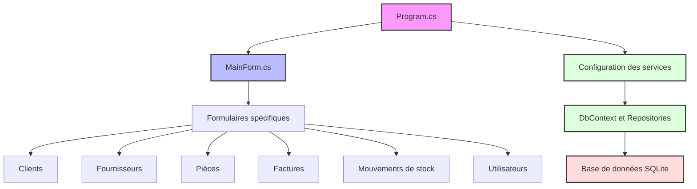
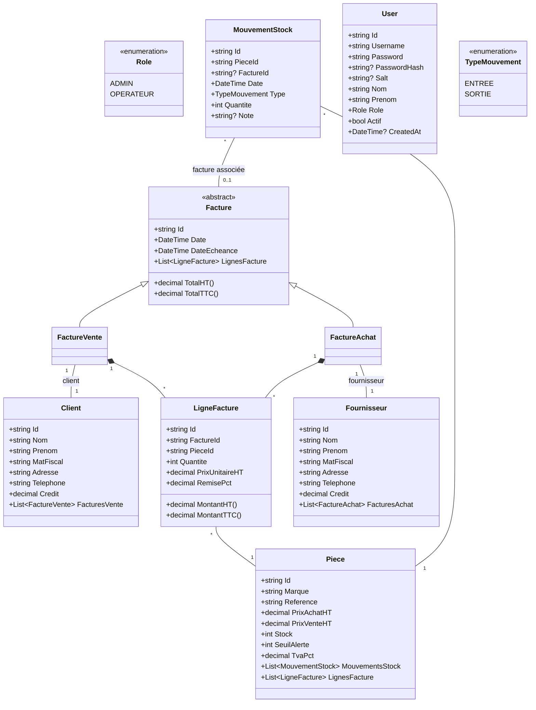
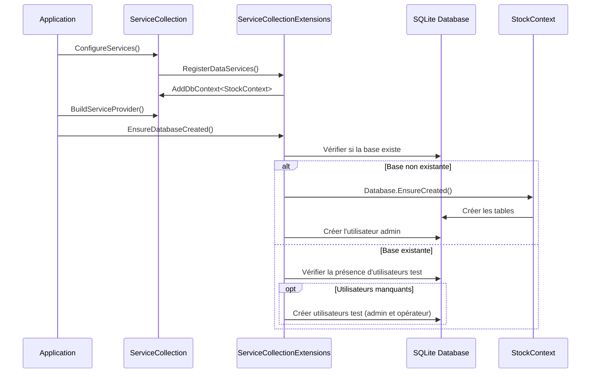
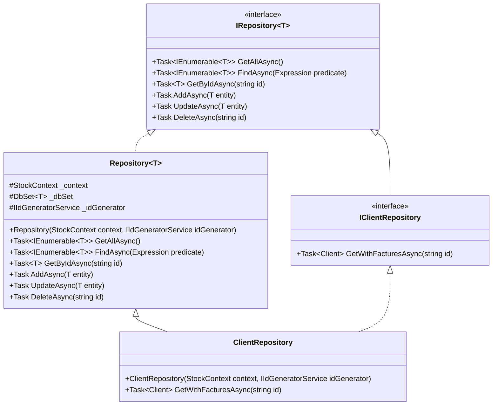
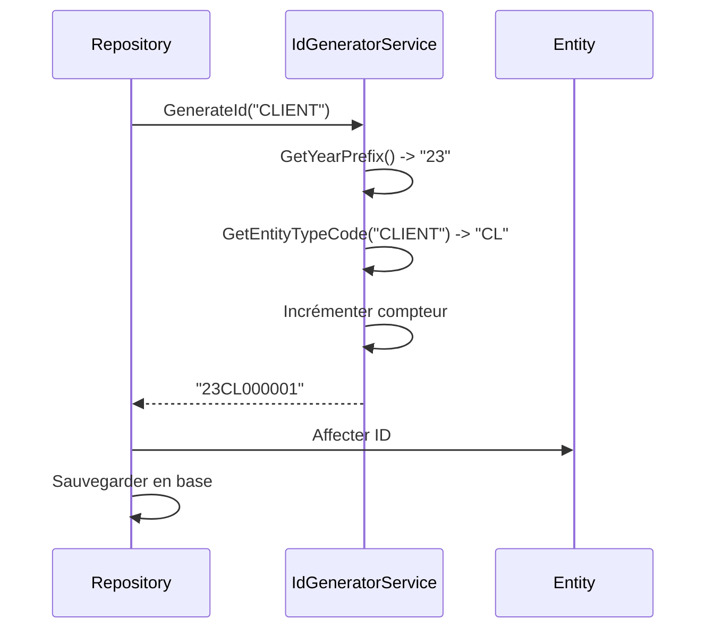
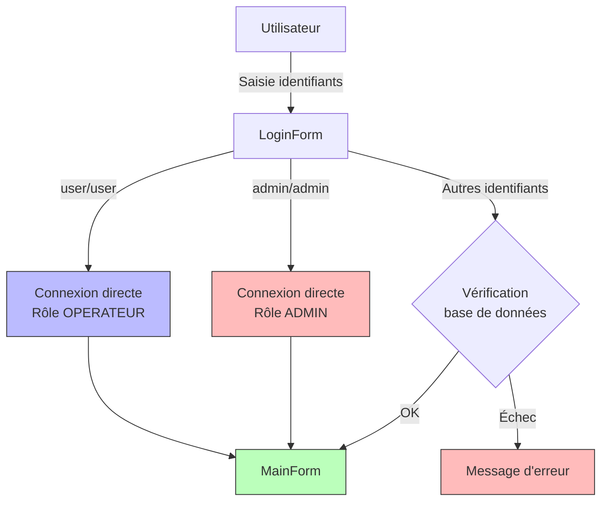
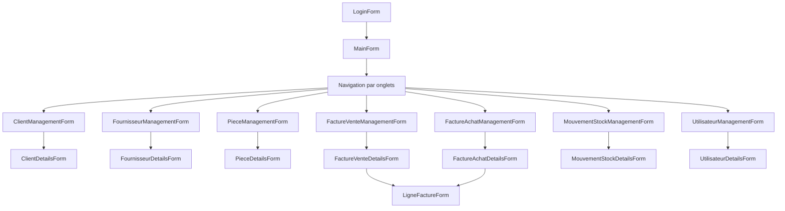
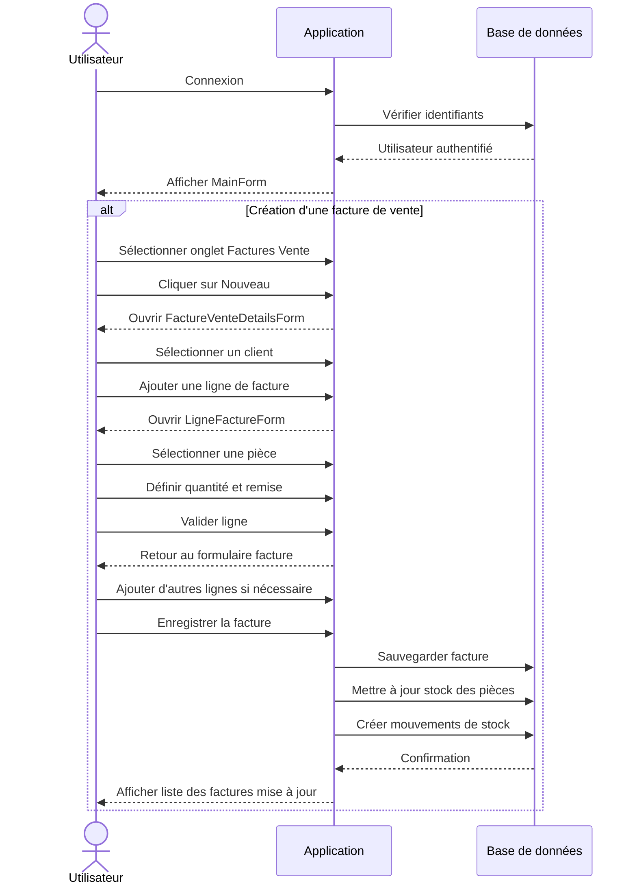
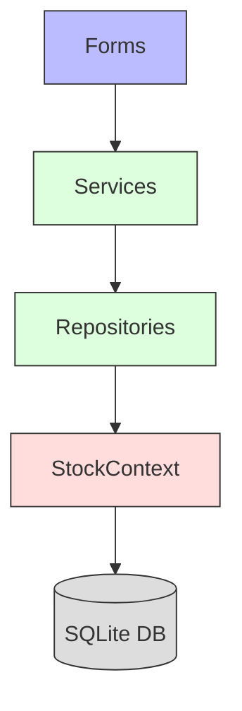

# Application de Gestion de Stock

Application de bureau pour la gestion de stock, développée en C# .NET Windows Forms et utilisant Entity Framework Core avec SQLite comme base de données.

## Table des matières

1. [Vue d'ensemble](#vue-densemble)
2. [Architecture du projet](#architecture-du-projet)
3. [Modèle de données](#modèle-de-données)
4. [Entity Framework Core et accès aux données](#entity-framework-core-et-accès-aux-données)
5. [Authentification et sécurité](#authentification-et-sécurité)
6. [Interface utilisateur](#interface-utilisateur)
7. [Guide d'utilisation](#guide-dutilisation)
8. [Diagrammes](#diagrammes)

## Vue d'ensemble

Cette application permet la gestion complète d'un stock de pièces automobiles, incluant :
- Gestion des clients et fournisseurs
- Gestion du catalogue de pièces
- Gestion des factures d'achat et de vente
- Suivi des mouvements de stock
- Gestion des utilisateurs avec différents niveaux d'accès

L'application utilise une architecture moderne basée sur:
- C# .NET 8.0
- Windows Forms avec la bibliothèque d'interface Krypton pour un design moderne
- Entity Framework Core 8 pour l'accès aux données
- SQLite comme moteur de base de données locale

## Architecture du projet



Le projet est structuré comme suit :

- **Program.cs** : Point d'entrée de l'application, configure les services (DI) et lance l'application
- **MainForm.cs** : Formulaire principal avec navigation par onglets vers les différentes fonctionnalités
- **Data/** : Contient tout ce qui est lié à l'accès aux données
  - **Entities/** : Classes des entités du modèle de données
  - **Repositories/** : Implémentation du pattern Repository pour l'accès aux données
  - **Services/** : Services métier
  - **StockContext.cs** : Classe DbContext d'Entity Framework
  - **ServiceCollectionExtensions.cs** : Configuration de l'injection de dépendances
- **Views/** : Formulaires Windows Forms organisés par fonctionnalité
  - **ClientForms/** : Gestion des clients
  - **FournisseurForms/** : Gestion des fournisseurs
  - **PieceForms/** : Gestion des pièces
  - **FactureForms/** : Gestion des factures (achat et vente)
  - **MouvementStockForms/** : Gestion des mouvements de stock
  - **UtilisateurForms/** : Gestion des utilisateurs
  - **LoginForm.cs** : Écran de connexion

## Modèle de données

Le modèle de données est représenté par les classes d'entités suivantes :



## Entity Framework Core et accès aux données

### Configuration de la base de données

L'application utilise Entity Framework Core avec SQLite. La base de données est automatiquement créée si elle n'existe pas au démarrage de l'application.



Le fichier de base de données est stocké dans le dossier AppData de l'utilisateur pour assurer la persistance entre les sessions et faciliter les mises à jour.

### Pattern Repository

L'accès aux données est implémenté en utilisant le pattern Repository :



Chaque entité possède son propre repository qui hérite de la classe générique `Repository<T>` avec des méthodes spécifiques si nécessaire.

### Génération d'identifiants

L'application utilise un service de génération d'identifiants (`IdGeneratorService`) qui crée des IDs au format `AATCNNNNNN` où :
- `AA` : Année sur 2 chiffres
- `TC` : Code de type d'entité (CL: Client, FR: Fournisseur, PC: Pièce, etc.)
- `NNNNNN` : Numéro séquentiel



## Authentification et sécurité

L'application implémente un système d'authentification avec gestion des utilisateurs:



Sécurité des mots de passe:
- Les mots de passe sont stockés avec un hash SHA-256 et un sel unique par utilisateur
- La classe `AuthService` gère l'authentification et l'enregistrement des utilisateurs
- Support pour les utilisateurs hérités (sans hash) pour assurer la compatibilité

## Interface utilisateur

L'application utilise la bibliothèque Krypton UI pour créer une interface moderne et intuitive:



## Guide d'utilisation

### Connexion

L'application dispose de deux comptes prédéfinis :
- **Administrateur** : 
  - Identifiant : `admin`
  - Mot de passe : `admin`
  - Accès complet à toutes les fonctionnalités
- **Opérateur** :
  - Identifiant : `user`
  - Mot de passe : `user`
  - Accès limité (pas de suppression ni gestion des utilisateurs)

### Fonctionnalités principales

- **Clients et Fournisseurs** : Gestion des données de contact et suivi des crédits
- **Pièces** : Catalogue des pièces avec gestion du stock et seuil d'alerte
- **Factures** : Création de factures d'achat (fournisseurs) et de vente (clients)
- **Mouvements de stock** : Suivi des entrées et sorties, avec ou sans facture associée
- **Utilisateurs** : Gestion des comptes et droits d'accès (admin uniquement)

## Diagrammes

### Flux de travail typique



### Architecture de l'accès aux données



Cette architecture en couches assure une séparation claire des responsabilités et facilite la maintenance de l'application.

## Migrations de base de données

L'application utilise la fonctionnalité `EnsureCreated()` d'Entity Framework pour créer la base de données au premier lancement, puis vérifie et ajoute des colonnes manquantes (comme `Salt` et `CreatedAt`) pour les bases existantes.

Pour les modifications plus importantes du schéma, il faudrait implémenter des migrations complètes via la commande:
```
dotnet ef migrations add [NomMigration]
``` 